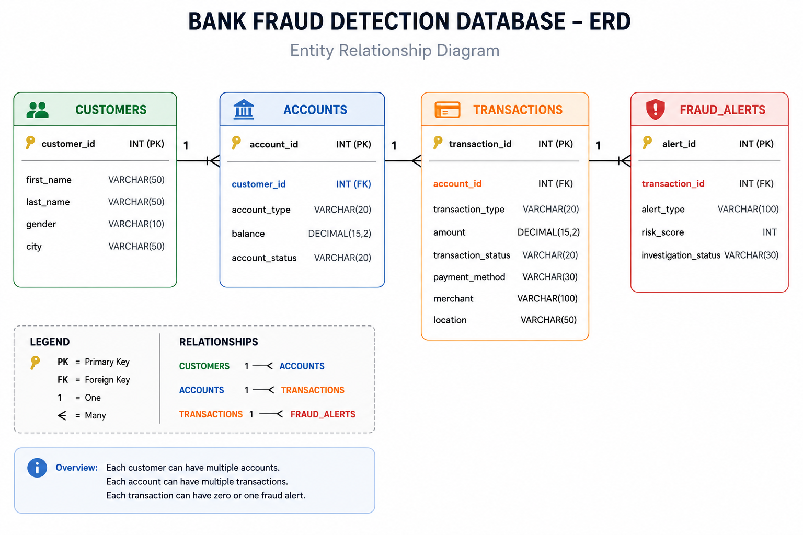

#  Bank Fraud Detection | SQL Project

##  Project Overview

This project focuses on analyzing banking transactions and fraud-related activity using SQL.

The main goal of the project is to identify suspicious transactions, analyze fraud alerts, evaluate customer transaction behavior, and classify customers based on their fraud risk.

The project was built as a beginner-to-intermediate SQL portfolio project and includes **35 business-focused SQL analysis tasks**. The analysis starts with basic transaction queries and gradually moves toward more advanced concepts such as **JOINs, CTEs, Window Functions, Subqueries, Correlated Subqueries, Ranking, and Fraud Risk Analysis**.

---

#  Project Objectives

The main objectives of this project are to:

* Analyze banking transactions and customer activity.
* Identify high-value and potentially suspicious transactions.
* Analyze transaction behavior based on payment methods and locations.
* Investigate transactions associated with fraud alerts.
* Identify customers with high fraud exposure.
* Compare transactions with overall and account-level averages.
* Rank customers and transactions based on different risk factors.
* Classify transactions and customers into different risk levels.
* Build a complete fraud analysis report using SQL.

---

#  Database Relationship Diagram

The project uses four related tables:

* **Customers**
* **Accounts**
* **Transactions**
* **Fraud Alerts**

The relationships between these tables are shown below:



The relationship flow is:

**Customers → Accounts → Transactions → Fraud Alerts**

This structure allows the project to analyze fraud activity from the customer level down to individual transactions.

---

#  Dataset Information

The dataset used in this project contains:

*  **30 Customers**
*  **30 Bank Accounts**
*  **60 Transactions**
*  **14 Fraud Alerts**

The dataset includes different transaction types, payment methods, locations, transaction statuses, and fraud alert categories to support realistic SQL analysis.

---

#  SQL Skills Demonstrated

This project covers a range of SQL concepts:

* `SELECT`
* `WHERE`
* `ORDER BY`
* `GROUP BY`
* `HAVING`
* Aggregate Functions

  * `SUM()`
  * `COUNT()`
  * `AVG()`
* `CASE` Statements
* `INNER JOIN`
* `LEFT JOIN`
* `RIGHT JOIN`
* Common Table Expressions (CTEs)
* Multiple CTEs
* Window Functions
* `OVER()`
* `PARTITION BY`
* `RANK()`
* `DENSE_RANK()`
* Running Totals
* Subqueries
* `IN`
* `NOT IN`
* Correlated Subqueries
* Fraud Risk Classification
* Customer Ranking and Risk Analysis

---

#  SQL Analysis Sections

The project contains **35 SQL analysis tasks**, organized into 6 sections.

## 1️ Basic Transaction Analysis

This section focuses on understanding the transaction dataset.

The analysis includes:

* Transaction overview
* High-value transactions
* Transaction type analysis
* Fraud risk classification
* Potential fraud transactions
* Transaction status analysis
* Payment method analysis
* City-based transaction analysis
* Suspicious transaction identification
* Risk category analysis

---

## 2️ Customer & Fraud Analysis Using JOINs

This section uses multiple table relationships to analyze customers and fraud activity.

The analysis includes:

* Customer transaction details
* Total transaction amount by customer
* Customers with high transaction activity
* Fraud alert investigation
* Customer fraud exposure

---

## 3️ CTE Analysis

Common Table Expressions were used to simplify multi-step analysis.

The tasks include:

* Customer transaction totals
* High-value customers
* Customer transaction statistics
* High-risk transaction summaries
* Fraud alert analysis by customer

---

## 4️ Window Function Analysis

This section focuses on analytical SQL queries using window functions.

The analysis includes:

* Ranking transactions by amount
* Ranking customers by total transaction amount
* Ranking customers within each city
* Detecting tied transaction amounts
* Calculating running transaction totals

---

## 5️ Subquery Analysis

This section uses subqueries to compare and filter transaction and customer data.

The tasks include:

* Transactions above the overall average
* Customers with high-value transactions
* Customers with above-average transaction values
* Customers with no fraud alerts
* Transactions above their account's average transaction amount

---

## 6️ Advanced Fraud Detection Challenges

The final section combines multiple SQL concepts to solve more complex business problems.

The challenges include:

* Identifying the top high-risk transactions
* Finding the most suspicious customers
* Detecting fraud transactions above the account average
* Ranking customers based on fraud alerts
* Creating an ultimate customer fraud analysis report

---

#  Key Analysis Areas

Some of the main business questions explored in this project include:

* Which transactions have unusually high amounts?
* Which customers have the highest transaction activity?
* Which transactions are associated with fraud alerts?
* Which customers have the highest fraud exposure?
* Which transactions are above their account's normal transaction behavior?
* Which customers have never been associated with fraud alerts?
* Which customers should be classified as High, Medium, or Low Risk?
* Which customers rank highest based on fraud alert activity?

---

#  Project Structure

```text
Bank-Fraud-Detection-SQL/
│
├── README.md
│
├── 01_database_schema.sql
│   └── Database and table creation queries
│
├── 02_insert_data.sql
│   └── Sample data for customers, accounts, transactions, and fraud alerts
│
├── 03_fraud_detection_analysis.sql
│   └── 35 SQL analysis tasks organized into 6 sections
│
└── images/
    └── database_erd.png
```

---

#  Key Learning Outcomes

Through this project, I improved my understanding of how SQL can be used to solve business-focused analytical problems.

Some of the key areas I practiced were:

* Working with multiple related tables.
* Understanding how different JOINs affect results.
* Performing customer and transaction-level analysis.
* Using CTEs to organize multi-step queries.
* Using Window Functions for ranking and analytical calculations.
* Writing Subqueries and Correlated Subqueries.
* Comparing individual transactions with overall and account-level averages.
* Using `CASE` statements for fraud and risk classification.
* Combining multiple SQL concepts to solve more complex analytical problems.

---

#  Future Improvements

Possible future improvements for this project include:

* Adding date-based transaction analysis.
* Performing fraud trend analysis over time.
* Adding more advanced fraud detection rules.
* Creating interactive dashboards using Power BI or Tableau.
* Connecting the SQL database with Python for further analysis and visualization.

---

#  Author

**Moiz Gaddafi**

Aspiring Data Analyst | Business Data Analytics Student

This project was created to practice and demonstrate SQL skills through a banking and fraud detection use case.

---

 If you found this project interesting, feel free to explore the SQL files in this repository.
